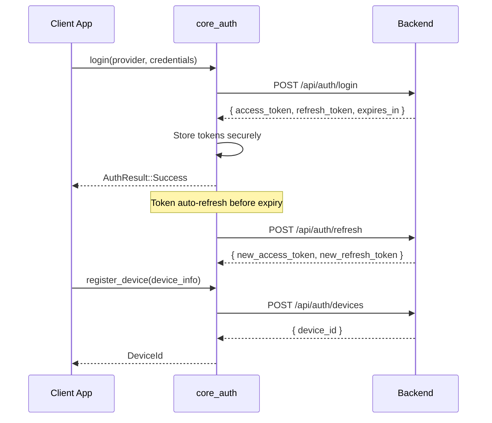
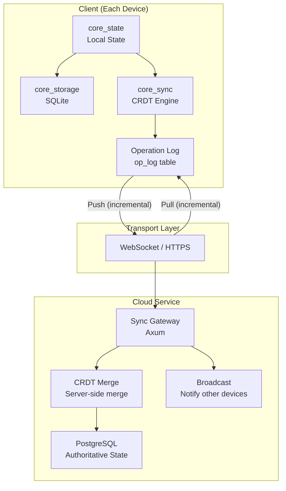
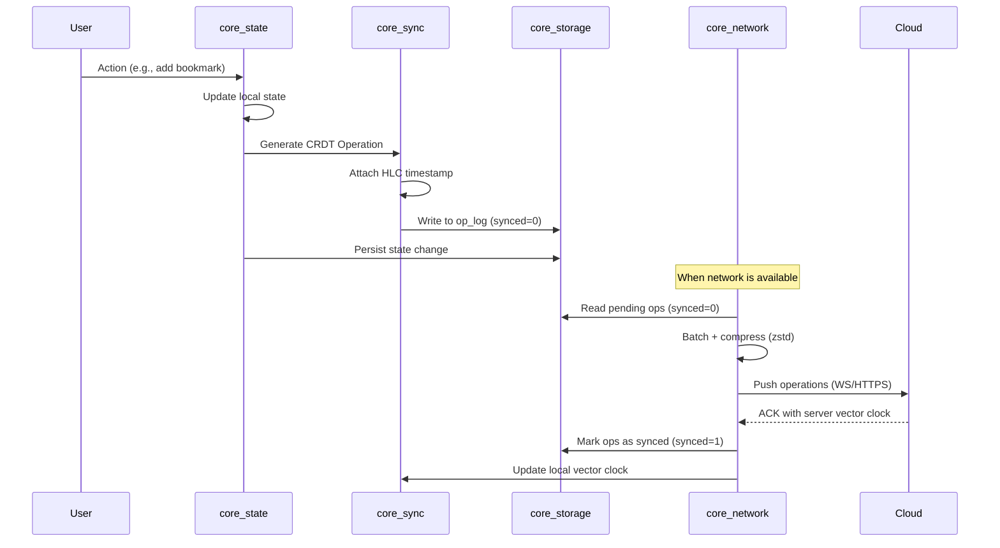
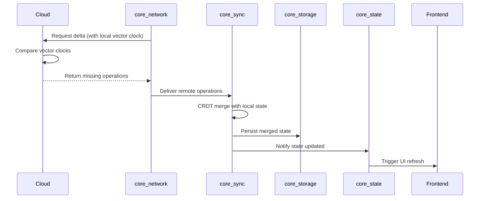
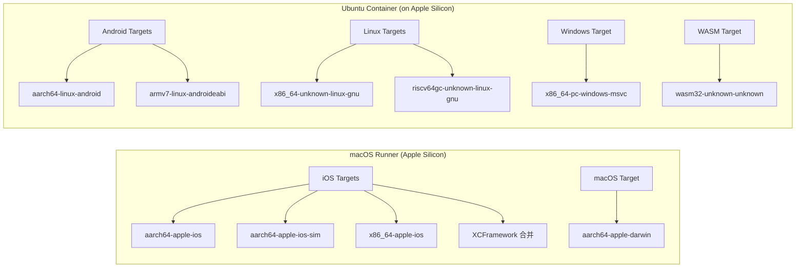

# 全平台高性能阅读器 — 完整项目规划

> **文档版本**: v1.0  
> **最后更新**: 2026-03-26  
> **状态**: 架构设计阶段

---

## 目录

- [1. 项目愿景](#1-项目愿景)
- [2. 核心架构：无头核心模型](#2-核心架构无头核心-headless-core-模型)
- [3. 技术栈清单](#3-技术栈清单)
- [4. Rust Workspace 模块划分](#4-rust-workspace-模块划分)
- [5. 项目目录结构](#5-项目目录结构)
- [6. 核心模块详细设计](#6-核心模块详细设计)
- [7. 云端同步架构设计](#7-云端同步架构设计)
- [8. 跨架构编译与构建环境规范](#8-跨架构编译与构建环境规范cicd)
- [9. 核心技术约束](#9-核心技术约束)
- [10. 后端服务设计](#10-后端服务设计)
- [11. 测试策略](#11-测试策略)
- [12. 开发路线图](#12-开发路线图)
- [13. 附录](#13-附录)

---

## 1. 项目愿景

构建一个**极致性能、极广兼容性**的多端阅读器。覆盖：

| 平台 | 形态 |
|------|------|
| 移动端 | iOS / Android |
| 桌面端 | Windows / macOS / Linux |
| 命令行 | CLI (全架构独立可执行文件) |
| 编辑器 | VS Code 插件 |

**核心诉求**：
- UI 层与核心逻辑层**严格解耦**
- 支持跨越 `arm64`、`arm32`、`x86_64`、`riscv64` 等多指令集架构
- 离线优先，云端同步
- 极低内存占用，极快启动速度

---

## 2. 核心架构：无头核心 (Headless Core) 模型

采用 **"一个底层引擎 + 多种渲染壳"** 的设计。所有业务逻辑下沉至纯 C-ABI 兼容层或 WebAssembly，各端前端仅保留极其轻量的 UI 渲染和事件分发功能。

```
┌─────────────────────────────────────────────────────────┐
│                      前端渲染层                          │
│  ┌──────────┐ ┌──────────┐ ┌────────┐ ┌──────────────┐  │
│  │ Flutter  │ │ ratatui  │ │ VS Code│ │   Web App    │  │
│  │(iOS/And/ │ │  (CLI)   │ │ (WASM) │ │   (WASM)     │  │
│  │ Desktop) │ │          │ │        │ │              │  │
│  └────┬─────┘ └────┬─────┘ └───┬────┘ └──────┬───────┘  │
│       │FFI         │Static     │WASM         │WASM      │
├───────┴────────────┴───────────┴─────────────┴──────────┤
│                    桥接层 (Bridge)                        │
│         ┌──────────────┐    ┌──────────────┐             │
│         │   ffi_c      │    │   ffi_wasm   │             │
│         │ (C-ABI/.so/  │    │ (wasm-bindgen│             │
│         │  .dylib/.dll)│    │  + TS types) │             │
│         └──────┬───────┘    └──────┬───────┘             │
├────────────────┴───────────────────┴────────────────────┤
│                  Rust 无头核心 (Headless Core)            │
│  ┌────────────┐ ┌────────────┐ ┌────────────────────┐   │
│  │core_parser │ │core_state  │ │   core_sync        │   │
│  │(格式解析)   │ │(状态管理)   │ │   (CRDT同步引擎)    │   │
│  └────────────┘ └────────────┘ └────────────────────┘   │
│  ┌────────────┐ ┌────────────┐ ┌────────────────────┐   │
│  │core_storage│ │core_auth   │ │   core_network     │   │
│  │(SQLite)    │ │(认证)      │ │   (网络抽象)        │   │
│  └────────────┘ └────────────┘ └────────────────────┘   │
└─────────────────────────────────────────────────────────┘
```

---

## 3. 技术栈清单

| 层级 | 技术选型 | 说明 |
|------|----------|------|
| **核心逻辑层** | 纯 Rust | 全部业务逻辑，零平台依赖 |
| **移动/桌面 GUI** | Flutter + flutter_rust_bridge | 通过 FFI 调用 Rust Core |
| **命令行端** | Rust + ratatui | 静态链接，独立可执行文件 |
| **VS Code 插件** | TypeScript + WebAssembly | WASM 跨架构免编译 |
| **本地存储** | SQLite (rusqlite) | 纯 C 实现，全架构兼容 |
| **云端同步** | CRDT + HLC | 离线优先，无冲突合并 |
| **后端服务** | Rust (Axum + Tokio) | 高性能异步服务 |
| **后端数据库** | PostgreSQL | 权威状态存储 |
| **数据序列化** | FlatBuffers / MessagePack | 零拷贝，高性能 |
| **传输压缩** | zstd | 流式压缩，高压缩比 |

---

## 4. Rust Workspace 模块划分

```toml
# Cargo.toml (workspace root)
[workspace]
members = [
    # === Core Modules (纯逻辑，零平台依赖) ===
    "crates/core_parser",      # 格式解析引擎
    "crates/core_state",       # 状态管理
    "crates/core_sync",        # CRDT 同步引擎
    "crates/core_storage",     # SQLite 本地持久化
    "crates/core_auth",        # 用户认证
    "crates/core_network",     # 网络抽象层

    # === Bridge Modules (桥接层) ===
    "crates/ffi_c",            # C-ABI 导出 (Flutter/原生)
    "crates/ffi_wasm",         # WASM 导出 (VS Code/Web)

    # === Application Modules ===
    "crates/cli",              # CLI 应用 (ratatui)
    "crates/backend",          # 后端服务 (Axum)
]
```

### 模块职责详表

| 模块 | 职责 | 依赖 | 平台约束 |
|------|------|------|----------|
| `core_parser` | EPUB/TXT/PDF 解析为结构化 DOM 树或纯文本流 | 无外部平台依赖 | `no_std` 兼容 |
| `core_state` | 阅读进度 (CFI)、用户偏好、书架管理 | `core_storage`, `core_sync` | 纯 Rust |
| `core_sync` | CRDT 类型库、HLC 时钟、Operation 编解码、向量时钟 | 无 | 纯 Rust |
| `core_storage` | SQLite CRUD、op_log 表、sync_metadata 表 | `rusqlite` | 纯 Rust + C (SQLite) |
| `core_auth` | JWT Token 管理、设备注册、会话维持 | `core_network` | 纯 Rust |
| `core_network` | HTTP/WebSocket 客户端封装、重连策略、带宽感知 | 条件编译 | trait 抽象 |
| `ffi_c` | 导出 C-ABI，生成 `.so`/`.dylib`/`.a`/`.dll` | 所有 `core_*` | Native |
| `ffi_wasm` | 导出 WASM + TypeScript 类型声明 | 所有 `core_*` | `wasm32` |
| `cli` | 终端 TUI 阅读器 | 所有 `core_*`, `ratatui` | Native |
| `backend` | 云端同步服务、用户管理 | `axum`, `tokio`, `sqlx` | Server |

---

## 5. 项目目录结构

```
reader/
├── Cargo.toml                          # Workspace 根配置
├── Cargo.lock
├── ARCHITECTURE.md                     # 本文档
├── .github/
│   └── workflows/
│       ├── ci.yml                      # 持续集成
│       ├── release-android.yml         # Android 构建
│       ├── release-apple.yml           # iOS/macOS 构建
│       ├── release-desktop.yml         # Windows/Linux 构建
│       ├── release-wasm.yml            # WASM 构建
│       └── release-backend.yml         # 后端部署
│
├── crates/
│   ├── core_parser/
│   │   ├── Cargo.toml
│   │   └── src/
│   │       ├── lib.rs                  # 模块入口
│   │       ├── epub/
│   │       │   ├── mod.rs              # EPUB 解析器
│   │       │   ├── container.rs        # OPF container 解析
│   │       │   ├── navigation.rs       # NCX/NAV 导航解析
│   │       │   └── content.rs          # XHTML 内容解析
│   │       ├── txt/
│   │       │   ├── mod.rs              # TXT 解析器
│   │       │   └── encoding.rs         # 编码检测 (UTF-8/GBK/...)
│   │       ├── pdf/
│   │       │   └── mod.rs              # PDF 解析器 (预留)
│   │       └── dom/
│   │           ├── mod.rs              # 结构化 DOM 树定义
│   │           ├── node.rs             # DOM 节点类型
│   │           └── style.rs            # 样式属性
│   │
│   ├── core_state/
│   │   ├── Cargo.toml
│   │   └── src/
│   │       ├── lib.rs
│   │       ├── progress.rs             # 阅读进度 (CFI 规范)
│   │       ├── preference.rs           # 用户偏好 (字体/主题/排版)
│   │       ├── bookshelf.rs            # 书架管理
│   │       ├── bookmark.rs             # 书签
│   │       ├── annotation.rs           # 高亮与批注
│   │       └── statistics.rs           # 阅读统计
│   │
│   ├── core_sync/
│   │   ├── Cargo.toml
│   │   └── src/
│   │       ├── lib.rs
│   │       ├── hlc.rs                  # 混合逻辑时钟 (HLC)
│   │       ├── vector_clock.rs         # 向量时钟
│   │       ├── crdt/
│   │       │   ├── mod.rs
│   │       │   ├── lww_register.rs     # Last-Writer-Wins Register
│   │       │   ├── or_set.rs           # Observed-Remove Set
│   │       │   ├── g_counter.rs        # Grow-only Counter
│   │       │   └── lww_map.rs          # LWW Map
│   │       ├── operation.rs            # Operation 编解码
│   │       ├── merge.rs                # 合并引擎
│   │       └── sync_manager.rs         # 同步流程管理
│   │
│   ├── core_storage/
│   │   ├── Cargo.toml
│   │   └── src/
│   │       ├── lib.rs
│   │       ├── schema.rs              # 数据库 Schema 定义
│   │       ├── migrations/            # 数据库迁移脚本
│   │       │   ├── mod.rs
│   │       │   ├── v001_init.rs
│   │       │   └── v002_sync_tables.rs
│   │       ├── book_repo.rs           # 书籍数据仓库
│   │       ├── state_repo.rs          # 状态数据仓库
│   │       ├── op_log_repo.rs         # Operation 日志仓库
│   │       └── sync_meta_repo.rs      # 同步元数据仓库
│   │
│   ├── core_auth/
│   │   ├── Cargo.toml
│   │   └── src/
│   │       ├── lib.rs
│   │       ├── token.rs               # JWT Token 管理
│   │       ├── device.rs              # 设备注册与管理
│   │       ├── session.rs             # 会话维持
│   │       └── oauth.rs               # OAuth 2.0 第三方登录
│   │
│   ├── core_network/
│   │   ├── Cargo.toml
│   │   └── src/
│   │       ├── lib.rs
│   │       ├── traits.rs             # 网络抽象 trait
│   │       ├── native/               # 原生平台实现
│   │       │   ├── mod.rs
│   │       │   ├── http_client.rs    # reqwest 封装
│   │       │   └── ws_client.rs      # tokio-tungstenite 封装
│   │       ├── wasm/                 # WASM 平台实现
│   │       │   ├── mod.rs
│   │       │   ├── http_client.rs    # web-sys fetch 封装
│   │       │   └── ws_client.rs      # web-sys WebSocket 封装
│   │       ├── retry.rs              # 重连与重试策略
│   │       └── bandwidth.rs          # 带宽感知与自适应
│   │
│   ├── ffi_c/
│   │   ├── Cargo.toml
│   │   ├── src/
│   │   │   ├── lib.rs               # C-ABI 导出函数
│   │   │   ├── types.rs             # FFI 安全类型定义
│   │   │   ├── parser_ffi.rs        # 解析器 FFI 接口
│   │   │   ├── state_ffi.rs         # 状态管理 FFI 接口
│   │   │   ├── sync_ffi.rs          # 同步 FFI 接口
│   │   │   └── error.rs             # 错误码定义
│   │   └── cbindgen.toml            # C 头文件生成配置
│   │
│   ├── ffi_wasm/
│   │   ├── Cargo.toml
│   │   ├── src/
│   │   │   ├── lib.rs               # WASM 导出
│   │   │   ├── parser_wasm.rs       # 解析器 WASM 接口
│   │   │   ├── state_wasm.rs        # 状态管理 WASM 接口
│   │   │   └── sync_wasm.rs         # 同步 WASM 接口
│   │   └── pkg/                     # wasm-pack 输出目录
│   │
│   ├── cli/
│   │   ├── Cargo.toml
│   │   └── src/
│   │       ├── main.rs              # CLI 入口
│   │       ├── app.rs               # 应用状态机
│   │       ├── ui/
│   │       │   ├── mod.rs
│   │       │   ├── reader.rs        # 阅读界面
│   │       │   ├── library.rs       # 书库界面
│   │       │   └── settings.rs      # 设置界面
│   │       └── keybindings.rs       # 快捷键配置
│   │
│   └── backend/
│       ├── Cargo.toml
│       └── src/
│           ├── main.rs              # 服务入口
│           ├── config.rs            # 配置管理
│           ├── api/
│           │   ├── mod.rs
│           │   ├── auth.rs          # 认证 API
│           │   ├── sync.rs          # 同步 API
│           │   └── user.rs          # 用户管理 API
│           ├── service/
│           │   ├── mod.rs
│           │   ├── sync_service.rs  # CRDT 合并服务
│           │   ├── auth_service.rs  # 认证服务
│           │   └── push_service.rs  # 变更广播服务
│           ├── db/
│           │   ├── mod.rs
│           │   ├── schema.sql       # PostgreSQL Schema
│           │   └── migrations/      # 数据库迁移
│           └── ws/
│               ├── mod.rs
│               └── handler.rs       # WebSocket 连接管理
│
├── flutter_app/                      # Flutter 前端
│   ├── pubspec.yaml
│   ├── lib/
│   │   ├── main.dart
│   │   ├── bridge/                  # flutter_rust_bridge 生成
│   │   ├── pages/
│   │   │   ├── reader_page.dart     # 阅读页
│   │   │   ├── library_page.dart    # 书库页
│   │   │   ├── settings_page.dart   # 设置页
│   │   │   └── sync_page.dart       # 同步状态页
│   │   ├── widgets/
│   │   │   ├── reader_view.dart     # 阅读渲染组件
│   │   │   ├── toc_drawer.dart      # 目录抽屉
│   │   │   └── annotation_bar.dart  # 批注工具栏
│   │   └── theme/
│   │       ├── app_theme.dart       # 主题定义
│   │       └── reading_theme.dart   # 阅读主题 (护眼/夜间/...)
│   ├── android/
│   ├── ios/
│   ├── macos/
│   ├── windows/
│   └── linux/
│
├── vscode_extension/                 # VS Code 插件
│   ├── package.json
│   ├── tsconfig.json
│   ├── src/
│   │   ├── extension.ts             # 插件入口
│   │   ├── wasm_bridge.ts           # WASM 桥接
│   │   ├── reader_panel.ts          # Webview 阅读面板
│   │   └── commands.ts              # 命令注册
│   └── wasm/                        # WASM 产物放置
│
├── scripts/
│   ├── build_android.sh             # Android 构建脚本
│   ├── build_ios.sh                 # iOS 构建脚本 (含 XCFramework)
│   ├── build_wasm.sh                # WASM 构建脚本
│   └── build_all.sh                 # 全平台构建
│
└── tests/
    ├── integration/                  # 集成测试
    └── fixtures/                     # 测试用书籍文件
        ├── sample.epub
        ├── sample.txt
        └── sample_utf8.txt
```

---

## 6. 核心模块详细设计

### 6.1 core_parser — 格式解析引擎

**职责**：将 EPUB/TXT 等文件脱离 WebView，纯解析为结构化 DOM 树或纯文本流。

**支持格式路线图**：

| 格式 | 优先级 | 解析策略 |
|------|--------|----------|
| EPUB 2/3 | 🔴 P0 | 解压 ZIP → 解析 OPF → 解析 XHTML → 构建 DOM 树 |
| TXT | 🔴 P0 | 编码检测 → 分段 → 构建纯文本流 |
| PDF | 🟡 P1 | 基于 pdf-rs 提取文本层 |
| MOBI/AZW | 🟢 P2 | 转换为 EPUB 中间格式后解析 |
| CBZ/CBR | 🟢 P2 | 解压 → 图片序列 |

**核心数据结构**：

```rust
// core_parser/src/dom/node.rs

/// Platform-independent DOM node for rendering
#[repr(C)]
pub enum NodeKind {
    Document,
    Heading { level: u8 },
    Paragraph,
    Text,
    Image { src_index: u32 },
    Link { href_index: u32 },
    List { ordered: bool },
    ListItem,
    Table,
    TableRow,
    TableCell,
    Emphasis,
    Strong,
    Code,
    BlockQuote,
}

/// A single node in the document tree
pub struct DomNode {
    pub kind: NodeKind,
    pub text_content: Option<String>,
    pub children: Vec<DomNode>,
    pub style: StyleProperties,
    pub cfi_anchor: String,  // CFI position identifier
}

/// Parsed book structure
pub struct ParsedBook {
    pub metadata: BookMetadata,
    pub toc: Vec<TocEntry>,       // Table of contents
    pub chapters: Vec<Chapter>,    // Ordered chapter list
    pub resources: ResourceMap,    // Images, fonts, CSS
}
```

### 6.2 core_state — 状态管理

**职责**：维护所有用户可变状态，作为 CRDT 变更的生产者。

```rust
// core_state/src/progress.rs

/// Reading progress based on EPUB CFI specification
pub struct ReadingProgress {
    pub book_id: BookId,
    pub cfi: String,              // e.g., "epubcfi(/6/4!/4/2/1:0)"
    pub percentage: f32,          // 0.0 ~ 1.0
    pub last_read_at: u64,        // HLC timestamp
    pub device_id: DeviceId,
}

// core_state/src/annotation.rs

/// User annotation (highlight + optional note)
pub struct Annotation {
    pub id: AnnotationId,
    pub book_id: BookId,
    pub cfi_range: CfiRange,      // Start and end CFI
    pub highlight_color: u32,     // RGBA
    pub note: Option<String>,
    pub created_at: u64,          // HLC timestamp
    pub updated_at: u64,          // HLC timestamp
}
```

**状态变更流**：

```
User Action → core_state (update local) → core_sync (generate CRDT Op)
                    ↓                              ↓
            core_storage (persist)          op_log (queue for sync)
```

### 6.3 core_sync — CRDT 同步引擎

> 详见 [第 7 节](#7-云端同步架构设计)

### 6.4 core_storage — 本地持久化

**SQLite Schema 概览**：

```sql
-- Books metadata
CREATE TABLE books (
    id          TEXT PRIMARY KEY,
    title       TEXT NOT NULL,
    author      TEXT,
    format      TEXT NOT NULL,       -- 'epub', 'txt', 'pdf'
    file_hash   TEXT NOT NULL,       -- SHA-256
    file_size   INTEGER,
    cover_path  TEXT,
    added_at    INTEGER NOT NULL,    -- Unix timestamp
    metadata    TEXT                 -- JSON blob
);

-- Reading progress
CREATE TABLE reading_progress (
    book_id     TEXT PRIMARY KEY REFERENCES books(id),
    cfi         TEXT NOT NULL,
    percentage  REAL NOT NULL,
    updated_at  INTEGER NOT NULL     -- HLC timestamp
);

-- Bookmarks
CREATE TABLE bookmarks (
    id          TEXT PRIMARY KEY,
    book_id     TEXT NOT NULL REFERENCES books(id),
    cfi         TEXT NOT NULL,
    title       TEXT,
    created_at  INTEGER NOT NULL
);

-- Annotations (highlights + notes)
CREATE TABLE annotations (
    id              TEXT PRIMARY KEY,
    book_id         TEXT NOT NULL REFERENCES books(id),
    cfi_start       TEXT NOT NULL,
    cfi_end         TEXT NOT NULL,
    highlight_color INTEGER,
    note            TEXT,
    created_at      INTEGER NOT NULL,
    updated_at      INTEGER NOT NULL
);

-- User preferences
CREATE TABLE preferences (
    key         TEXT PRIMARY KEY,
    value       TEXT NOT NULL,
    updated_at  INTEGER NOT NULL
);

-- CRDT Operation log (sync queue)
CREATE TABLE op_log (
    id          INTEGER PRIMARY KEY AUTOINCREMENT,
    op_type     TEXT NOT NULL,        -- 'progress', 'bookmark', 'annotation', ...
    op_data     BLOB NOT NULL,        -- FlatBuffers encoded operation
    hlc_ts      INTEGER NOT NULL,     -- HLC timestamp
    device_id   TEXT NOT NULL,
    synced      INTEGER DEFAULT 0,    -- 0=pending, 1=synced
    created_at  INTEGER NOT NULL
);

-- Sync metadata
CREATE TABLE sync_metadata (
    device_id       TEXT PRIMARY KEY,
    vector_clock    BLOB NOT NULL,    -- Serialized vector clock
    last_sync_at    INTEGER,
    server_url      TEXT
);

-- Reading statistics
CREATE TABLE reading_stats (
    date        TEXT NOT NULL,         -- 'YYYY-MM-DD'
    book_id     TEXT NOT NULL REFERENCES books(id),
    duration_ms INTEGER NOT NULL,      -- Reading duration in ms
    pages_read  INTEGER DEFAULT 0,
    PRIMARY KEY (date, book_id)
);
```

### 6.5 core_auth — 用户认证

**认证流程**：



**支持的认证方式**：
- Email + Password (自建)
- OAuth 2.0: Apple / Google / GitHub
- 匿名模式 (仅本地，不同步)

### 6.6 core_network — 网络抽象层

**核心设计**：通过 trait 抽象 + 条件编译实现跨平台统一接口。

```rust
// core_network/src/traits.rs

/// Platform-agnostic HTTP client trait
#[async_trait]
pub trait HttpClient: Send + Sync {
    async fn get(&self, url: &str, headers: &Headers) -> Result<Response>;
    async fn post(&self, url: &str, body: &[u8], headers: &Headers) -> Result<Response>;
    async fn put(&self, url: &str, body: &[u8], headers: &Headers) -> Result<Response>;
    async fn delete(&self, url: &str, headers: &Headers) -> Result<Response>;
}

/// Platform-agnostic WebSocket client trait
#[async_trait]
pub trait WsClient: Send + Sync {
    async fn connect(&mut self, url: &str) -> Result<()>;
    async fn send(&mut self, data: &[u8]) -> Result<()>;
    async fn recv(&mut self) -> Result<Vec<u8>>;
    async fn close(&mut self) -> Result<()>;
    fn is_connected(&self) -> bool;
}

// Conditional compilation for platform-specific implementations
// #[cfg(not(target_arch = "wasm32"))]  → native/ (reqwest + tokio-tungstenite)
// #[cfg(target_arch = "wasm32")]       → wasm/ (web-sys fetch + WebSocket)
```

**重连策略**：
- 指数退避 (Exponential Backoff): 1s → 2s → 4s → 8s → ... → 最大 60s
- 网络状态感知：WiFi/4G/离线 自动切换策略
- 弱网优化：自动降低同步频率，合并小包

---

## 7. 云端同步架构设计

### 7.1 同步策略：离线优先 (Offline-First) + CRDT



### 7.2 需要同步的数据域

| 数据域 | 同步粒度 | CRDT 类型 | 冲突策略 |
|--------|----------|-----------|----------|
| **阅读进度** | 每本书的 CFI 位置 | LWW Register | 最新时间戳胜出 |
| **书签** | 单条书签 | OR-Set | 添加优先于删除 |
| **高亮/批注** | 单条标注 | OR-Set + LWW Register | 添加优先；内容取最新 |
| **用户偏好** | 键值对 | LWW Map | 最新时间戳胜出 |
| **书架/分组** | 书籍列表 | OR-Set | 添加优先于删除 |
| **阅读统计** | 每日聚合数据 | G-Counter | 自动合并，无冲突 |

### 7.3 CRDT 核心实现

```rust
// core_sync/src/hlc.rs

/// Hybrid Logical Clock — causal ordering without NTP dependency
/// All fields use fixed-width types for C-ABI safety
pub struct HLC {
    pub wall_time_ms: u64,   // Physical clock (milliseconds)
    pub logical: u16,        // Logical counter
    pub node_id: u64,        // Device unique identifier
}

impl HLC {
    /// Generate a new timestamp, guaranteed to be monotonically increasing
    pub fn now(&mut self) -> Timestamp { /* ... */ }

    /// Merge with a received remote timestamp
    pub fn receive(&mut self, remote: &Timestamp) -> Timestamp { /* ... */ }
}
```

```rust
// core_sync/src/crdt/lww_register.rs

/// Last-Writer-Wins Register — for single-value fields like reading progress
pub struct LWWRegister<T: Clone> {
    pub value: T,
    pub timestamp: Timestamp,
}

impl<T: Clone> LWWRegister<T> {
    pub fn set(&mut self, value: T, ts: Timestamp) {
        if ts > self.timestamp {
            self.value = value;
            self.timestamp = ts;
        }
    }

    pub fn merge(&mut self, other: &LWWRegister<T>) {
        if other.timestamp > self.timestamp {
            self.value = other.value.clone();
            self.timestamp = other.timestamp;
        }
    }
}
```

```rust
// core_sync/src/crdt/or_set.rs

/// Observed-Remove Set — for collections like bookmarks, annotations
/// Add-wins semantics: concurrent add + remove → element is kept
pub struct ORSet<T: Eq + Hash + Clone> {
    elements: HashMap<T, HashSet<UniqueTag>>,
    tombstones: HashMap<T, HashSet<UniqueTag>>,
}

impl<T: Eq + Hash + Clone> ORSet<T> {
    pub fn add(&mut self, value: T, tag: UniqueTag) { /* ... */ }
    pub fn remove(&mut self, value: &T) { /* ... */ }
    pub fn merge(&mut self, other: &ORSet<T>) { /* ... */ }
    pub fn contains(&self, value: &T) -> bool { /* ... */ }
    pub fn elements(&self) -> Vec<&T> { /* ... */ }
}
```

### 7.4 同步流程

#### 推送流程 (本地 → 云端)



#### 拉取流程 (云端 → 本地)



### 7.5 网络传输协议

| 场景 | 协议 | 说明 |
|------|------|------|
| 实时同步 | WebSocket | 设备在线时保持长连接，低延迟推拉 |
| 离线恢复 | HTTPS REST | 设备重新上线时批量同步 |
| 数据编码 | FlatBuffers / MessagePack | 零拷贝反序列化，比 JSON 节省 60%+ 带宽 |
| 压缩 | zstd | 对 op_log 批量传输启用流式压缩 |
| 单包限制 | ≤ 256KB | 超出自动分片，防弱网超时 |

### 7.6 安全与隐私

| 层面 | 方案 | 说明 |
|------|------|------|
| 传输加密 | TLS 1.3 | 全链路加密 |
| 端到端加密 | E2EE (可选) | 批注等敏感数据，服务端仅存密文 |
| 认证 | OAuth 2.0 + JWT | 支持 Apple/Google/GitHub 登录 |
| 设备管理 | 设备注册/撤销 | 撤销后向量时钟条目失效 |
| 数据擦除 | 账户删除 | GDPR 合规，完全清除用户数据 |

### 7.7 时钟方案：混合逻辑时钟 (HLC)

**为什么不用 NTP？**
- 移动设备时钟可能被用户手动修改
- 不同设备间时钟偏差可达数秒
- NTP 同步在离线场景不可用

**HLC 优势**：
- 结合物理时钟和逻辑计数器
- 每个设备维护独立的 HLC 实例
- 保证因果序 (Causal Ordering)，即使设备时钟有偏差
- 时间戳可读性好（接近真实时间）

---

## 8. 跨架构编译与构建环境规范 (CI/CD)

### 8.1 核心编译目标矩阵

| 阵营 | Target Triple | 用途 |
|------|---------------|------|
| **Android** | `aarch64-linux-android` | Android ARM64 (主流) |
| | `armv7-linux-androideabi` | Android ARM32 (兼顾旧设备) |
| **Apple iOS** | `aarch64-apple-ios` | iOS 真机 |
| | `aarch64-apple-ios-sim` | Apple Silicon 模拟器 |
| | `x86_64-apple-ios` | Intel 模拟器 |
| **Apple macOS** | `aarch64-apple-darwin` | macOS Apple Silicon |
| **Windows** | `x86_64-pc-windows-msvc` | Windows PC |
| **Linux** | `x86_64-unknown-linux-gnu` | Linux x86_64 |
| | `riscv64gc-unknown-linux-gnu` | RISC-V 设备 |
| **WASM** | `wasm32-unknown-unknown` | VS Code 插件 / Web |

### 8.2 构建策略



### 8.3 iOS XCFramework 构建

编译出各架构的静态库 (`.a`) 后，**必须**通过 `xcodebuild -create-xcframework` 合并：

```bash
#!/bin/bash
# scripts/build_ios.sh

# Step 1: Build for each iOS target
cargo build --release --target aarch64-apple-ios       -p ffi_c
cargo build --release --target aarch64-apple-ios-sim   -p ffi_c
cargo build --release --target x86_64-apple-ios        -p ffi_c

# Step 2: Create fat library for simulators (ARM64 + x86_64)
lipo -create \
    target/aarch64-apple-ios-sim/release/libffi_c.a \
    target/x86_64-apple-ios/release/libffi_c.a \
    -output target/universal-ios-sim/libffi_c.a

# Step 3: Create XCFramework
xcodebuild -create-xcframework \
    -library target/aarch64-apple-ios/release/libffi_c.a \
    -headers crates/ffi_c/include/ \
    -library target/universal-ios-sim/libffi_c.a \
    -headers crates/ffi_c/include/ \
    -output target/ReaderCore.xcframework
```

### 8.4 WASM 构建

```bash
#!/bin/bash
# scripts/build_wasm.sh

# Build WASM module with wasm-pack
wasm-pack build crates/ffi_wasm \
    --target web \
    --out-dir ../../vscode_extension/wasm \
    --release

# Optimize WASM binary size
wasm-opt -Oz -o output.wasm input.wasm
```

---

## 9. 核心技术约束

### 9.1 内存对齐限制

跨 C-ABI 边界传参时，**严禁使用变长类型**：

| ❌ 禁止 | ✅ 必须使用 | 原因 |
|---------|------------|------|
| `long` | `int32_t` / `int64_t` | `long` 在 32/64 位系统宽度不同 |
| `size_t` | `uint32_t` / `uint64_t` | `size_t` 跟随指针宽度变化 |
| `usize` (Rust) | `u32` / `u64` | 同上 |
| `bool` | `int32_t` (0/1) | `bool` 的 ABI 表示不统一 |
| `enum` | `int32_t` | enum 底层类型不确定 |

**FFI 类型定义示例**：

```rust
// ffi_c/src/types.rs

/// All FFI-safe types must use fixed-width scalars
#[repr(C)]
pub struct FfiBookInfo {
    pub id_ptr: *const u8,        // UTF-8 string pointer
    pub id_len: u32,              // String length (NOT usize!)
    pub title_ptr: *const u8,
    pub title_len: u32,
    pub progress_pct: f32,        // 0.0 ~ 1.0
    pub last_read_ts: u64,        // HLC timestamp
}

/// Error codes — fixed int32_t, not enum
pub const FFI_OK: i32 = 0;
pub const FFI_ERR_NULL_PTR: i32 = -1;
pub const FFI_ERR_INVALID_UTF8: i32 = -2;
pub const FFI_ERR_PARSE_FAILED: i32 = -3;
pub const FFI_ERR_STORAGE: i32 = -4;
pub const FFI_ERR_NETWORK: i32 = -5;
pub const FFI_ERR_AUTH: i32 = -6;
```

### 9.2 无副作用原则

`core_*` 模块**严禁**引入任何特定平台的系统 API 依赖：

```
✅ 允许: std::collections, std::fmt, std::io (抽象 trait)
✅ 允许: serde, rusqlite, 纯 Rust 算法库
❌ 禁止: std::fs (文件系统直接操作)
❌ 禁止: std::net (直接网络调用)
❌ 禁止: 任何 #[cfg(target_os = "...")] 条件编译
❌ 禁止: libc, winapi, cocoa 等平台绑定
```

**例外**：`core_network` 通过 trait 抽象 + 条件编译隔离平台差异，但其 trait 定义本身是纯 Rust。

### 9.3 WASM 兼容约束

- 不可使用 `std::thread` (WASM 单线程)
- 不可使用 `std::time::SystemTime` (WASM 无系统时钟，需通过 JS 桥接)
- 异步运行时使用 `wasm-bindgen-futures` 而非 `tokio`
- 文件 I/O 通过 JS 桥接 (IndexedDB / File API)

---

## 10. 后端服务设计

### 10.1 服务架构

```
backend/
├── api_gateway/          # Axum HTTP/WS 入口，路由分发
├── sync_service/         # CRDT 合并 + 向量时钟比对
├── auth_service/         # 用户认证 (JWT + Refresh Token)
├── storage_service/      # PostgreSQL 持久化
│   ├── user_state/       # 用户同步状态 (向量时钟、设备注册)
│   └── op_store/         # Operation 日志存储
└── push_service/         # 变更通知广播 (WebSocket fanout)
```

### 10.2 API 设计

#### 认证 API

| Method | Path | 说明 |
|--------|------|------|
| POST | `/api/auth/register` | 注册新用户 |
| POST | `/api/auth/login` | 登录 (Email/OAuth) |
| POST | `/api/auth/refresh` | 刷新 Token |
| POST | `/api/auth/logout` | 登出 |
| GET | `/api/auth/devices` | 获取已授权设备列表 |
| POST | `/api/auth/devices` | 注册新设备 |
| DELETE | `/api/auth/devices/:id` | 撤销设备授权 |

#### 同步 API

| Method | Path | 说明 |
|--------|------|------|
| POST | `/api/sync/push` | 推送本地 Operations |
| POST | `/api/sync/pull` | 拉取远端 Operations (携带向量时钟) |
| GET | `/api/sync/status` | 获取同步状态 |
| WS | `/ws/sync` | WebSocket 实时同步通道 |

#### 用户 API

| Method | Path | 说明 |
|--------|------|------|
| GET | `/api/user/profile` | 获取用户信息 |
| PUT | `/api/user/profile` | 更新用户信息 |
| DELETE | `/api/user/account` | 删除账户 (GDPR) |

### 10.3 PostgreSQL Schema

```sql
-- Users
CREATE TABLE users (
    id          UUID PRIMARY KEY DEFAULT gen_random_uuid(),
    email       TEXT UNIQUE,
    password_hash TEXT,
    oauth_provider TEXT,
    oauth_id    TEXT,
    created_at  TIMESTAMPTZ DEFAULT NOW(),
    updated_at  TIMESTAMPTZ DEFAULT NOW()
);

-- Devices
CREATE TABLE devices (
    id          UUID PRIMARY KEY DEFAULT gen_random_uuid(),
    user_id     UUID NOT NULL REFERENCES users(id) ON DELETE CASCADE,
    device_name TEXT NOT NULL,
    device_type TEXT NOT NULL,       -- 'ios', 'android', 'desktop', 'cli', 'vscode'
    node_id     BIGINT NOT NULL,     -- HLC node_id
    vector_clock BYTEA,
    last_seen_at TIMESTAMPTZ,
    created_at  TIMESTAMPTZ DEFAULT NOW(),
    revoked     BOOLEAN DEFAULT FALSE
);

-- Operations (append-only log)
CREATE TABLE operations (
    id          BIGSERIAL PRIMARY KEY,
    user_id     UUID NOT NULL REFERENCES users(id) ON DELETE CASCADE,
    device_id   UUID NOT NULL REFERENCES devices(id),
    op_type     TEXT NOT NULL,
    op_data     BYTEA NOT NULL,      -- FlatBuffers encoded
    hlc_ts      BIGINT NOT NULL,
    created_at  TIMESTAMPTZ DEFAULT NOW()
);

-- Index for efficient delta sync
CREATE INDEX idx_operations_user_hlc ON operations(user_id, hlc_ts);
CREATE INDEX idx_operations_user_device ON operations(user_id, device_id);

-- Materialized user state (optional, for fast full-sync)
CREATE TABLE user_state_snapshot (
    user_id     UUID PRIMARY KEY REFERENCES users(id) ON DELETE CASCADE,
    state_data  BYTEA NOT NULL,      -- Full merged CRDT state
    vector_clock BYTEA NOT NULL,
    updated_at  TIMESTAMPTZ DEFAULT NOW()
);
```

---

## 11. 测试策略

### 11.1 测试金字塔

```
            ┌──────────┐
            │  E2E     │  Flutter Integration Tests
            │  Tests   │  (少量，关键路径)
           ┌┴──────────┴┐
           │ Integration │  跨模块集成测试
           │   Tests     │  (同步流程、FFI 调用)
          ┌┴─────────────┴┐
          │   Unit Tests   │  每个 core_* 模块的单元测试
          │                │  (CRDT 合并、解析器、状态管理)
          └────────────────┘
```

### 11.2 各层测试重点

| 层级 | 测试重点 | 工具 |
|------|----------|------|
| **core_parser** | EPUB/TXT 解析正确性、边界情况、编码检测 | `#[test]` + 测试 fixture 文件 |
| **core_sync** | CRDT 合并正确性、交换律/结合律/幂等性验证 | `#[test]` + proptest (属性测试) |
| **core_storage** | SQLite CRUD、迁移脚本、并发读写 | `#[test]` + tempfile |
| **core_network** | Mock server 测试、重连策略、超时处理 | `#[tokio::test]` + wiremock |
| **ffi_c** | C-ABI 调用正确性、内存安全、空指针处理 | C 测试程序 + Valgrind |
| **ffi_wasm** | WASM 模块加载、JS 互操作 | wasm-bindgen-test + Node.js |
| **集成测试** | 多设备同步场景、冲突解决 | 自定义测试框架 |
| **E2E** | 关键用户路径 (打开书→阅读→同步) | Flutter integration_test |

### 11.3 CRDT 属性测试

```rust
// core_sync/tests/crdt_properties.rs

use proptest::prelude::*;

proptest! {
    /// Commutativity: merge(a, b) == merge(b, a)
    #[test]
    fn lww_register_commutative(v1: String, ts1: u64, v2: String, ts2: u64) {
        let mut r1 = LWWRegister::new(v1.clone(), ts1);
        let mut r2 = LWWRegister::new(v2.clone(), ts2);

        let mut merged_1 = r1.clone();
        merged_1.merge(&r2);

        let mut merged_2 = r2.clone();
        merged_2.merge(&r1);

        assert_eq!(merged_1.value, merged_2.value);
    }

    /// Idempotency: merge(a, a) == a
    #[test]
    fn or_set_idempotent(elements: Vec<String>) {
        let mut set = ORSet::new();
        for e in &elements {
            set.add(e.clone(), UniqueTag::new());
        }

        let mut merged = set.clone();
        merged.merge(&set);

        assert_eq!(set.elements(), merged.elements());
    }
}
```

---

## 12. 开发路线图

### Phase 0: 基础设施 (第 1-2 周)

- [ ] 初始化 Rust Workspace 结构
- [ ] 配置 CI/CD 流水线 (GitHub Actions)
- [ ] 搭建交叉编译环境
- [ ] 配置代码质量工具 (clippy, rustfmt, cargo-deny)

### Phase 1: 核心引擎 — MVP (第 3-8 周)

- [ ] **core_parser**: EPUB 2/3 解析器
- [ ] **core_parser**: TXT 解析器 (含编码检测)
- [ ] **core_state**: 阅读进度管理 (CFI)
- [ ] **core_state**: 书签、高亮、批注
- [ ] **core_storage**: SQLite Schema + 基础 CRUD
- [ ] **ffi_c**: 基础 C-ABI 导出
- [ ] **ffi_wasm**: 基础 WASM 导出
- [ ] 单元测试覆盖率 > 80%

### Phase 2: 前端壳 — 可用 (第 9-14 周)

- [ ] **Flutter App**: 书库页面 (导入/管理书籍)
- [ ] **Flutter App**: 阅读页面 (翻页/进度/目录)
- [ ] **Flutter App**: 批注功能 (高亮/笔记)
- [ ] **Flutter App**: 设置页面 (字体/主题/排版)
- [ ] **CLI**: 基础阅读功能 (ratatui)
- [ ] **VS Code 插件**: 基础阅读面板
- [ ] iOS/Android/macOS/Windows 构建验证

### Phase 3: 云端同步 — 联网 (第 15-22 周)

- [ ] **core_sync**: HLC 实现
- [ ] **core_sync**: CRDT 类型库 (LWW Register, OR-Set, G-Counter)
- [ ] **core_sync**: Operation 编解码 (FlatBuffers)
- [ ] **core_sync**: 向量时钟 + 增量同步
- [ ] **core_auth**: JWT Token 管理
- [ ] **core_auth**: OAuth 2.0 (Apple/Google/GitHub)
- [ ] **core_network**: HTTP/WS 客户端 (Native + WASM)
- [ ] **core_network**: 重连策略 + 带宽感知
- [ ] **backend**: Axum 服务搭建
- [ ] **backend**: 同步 API (push/pull)
- [ ] **backend**: WebSocket 实时同步
- [ ] **backend**: PostgreSQL Schema + 迁移
- [ ] 多设备同步集成测试

### Phase 4: 体验打磨 — 精品 (第 23-30 周)

- [ ] 阅读统计与数据可视化
- [ ] 端到端加密 (E2EE) 可选
- [ ] 冲突版本历史查看
- [ ] PDF 格式支持
- [ ] MOBI/AZW 格式支持
- [ ] 性能优化 (启动速度、内存占用、渲染帧率)
- [ ] 无障碍 (Accessibility) 支持
- [ ] 国际化 (i18n)

### Phase 5: 扩展平台 (第 31+ 周)

- [ ] Linux 桌面适配
- [ ] RISC-V 架构验证
- [ ] Web App (独立网页版)
- [ ] 插件系统 (自定义解析器/主题)
- [ ] 社区功能 (书评/分享)

---

## 13. 附录

### 13.1 关键依赖版本参考

| 依赖 | 用途 | 建议版本 |
|------|------|----------|
| `rusqlite` | SQLite 绑定 | latest stable |
| `serde` | 序列化框架 | 1.x |
| `flatbuffers` | 零拷贝序列化 | latest stable |
| `rmp-serde` | MessagePack | latest stable |
| `zstd` | 压缩 | latest stable |
| `axum` | Web 框架 | 0.7+ |
| `tokio` | 异步运行时 | 1.x |
| `sqlx` | PostgreSQL 异步驱动 | 0.7+ |
| `reqwest` | HTTP 客户端 | 0.12+ |
| `tokio-tungstenite` | WebSocket 客户端 | latest stable |
| `wasm-bindgen` | WASM 绑定 | latest stable |
| `wasm-pack` | WASM 构建工具 | latest stable |
| `flutter_rust_bridge` | Flutter FFI 桥接 | 2.x |
| `ratatui` | TUI 框架 | latest stable |
| `proptest` | 属性测试 | 1.x |

### 13.2 CFI (Canonical Fragment Identifier) 规范

EPUB CFI 用于精确定位书籍中的位置，格式示例：

```
epubcfi(/6/4!/4/2/1:0)
         │ │  │ │ │ └── 字符偏移
         │ │  │ │ └──── 元素索引
         │ │  │ └────── 元素索引
         │ │  └──────── 文档内路径起始
         │ └─────────── spine 项索引
         └───────────── package 文档步进
```

### 13.3 术语表

| 术语 | 全称 | 说明 |
|------|------|------|
| CRDT | Conflict-free Replicated Data Type | 无冲突复制数据类型 |
| HLC | Hybrid Logical Clock | 混合逻辑时钟 |
| LWW | Last-Writer-Wins | 最后写入者胜出 |
| OR-Set | Observed-Remove Set | 观察-删除集合 |
| CFI | Canonical Fragment Identifier | EPUB 标准位置标识 |
| FFI | Foreign Function Interface | 外部函数接口 |
| C-ABI | C Application Binary Interface | C 语言应用二进制接口 |
| E2EE | End-to-End Encryption | 端到端加密 |
| GDPR | General Data Protection Regulation | 通用数据保护条例 |
